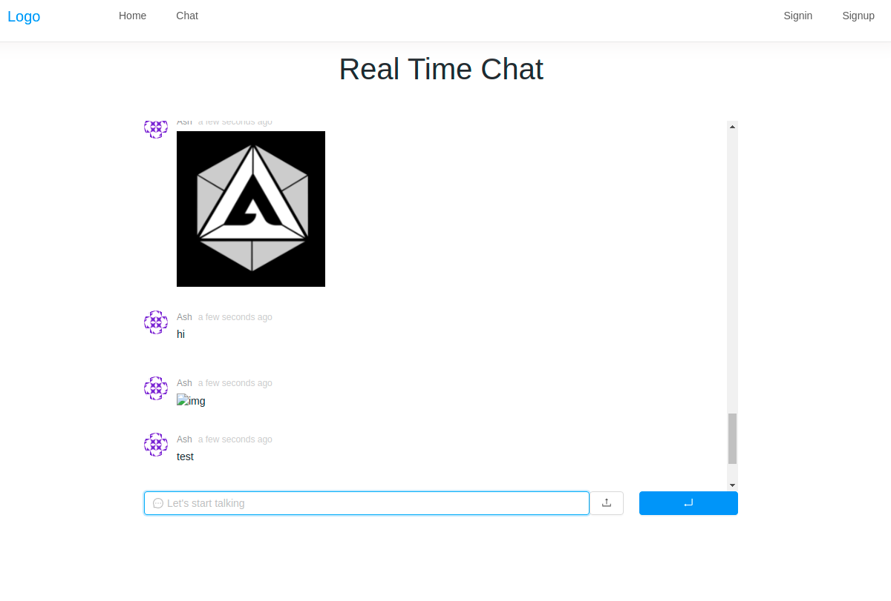

# Chat Clone

## Deployed Link: https://text-chat-clone.herokuapp.com/

## Technology Used

- React
- Nodejs
- Express
- Mongoose
- MongoDB
- Multer
- Socket.io

## Installation

- Fork/Clone or Download Zip
- Create dev.js file inside config folder and add MongoDB URI
- Run npm install in root and client directories
- Run npm run dev in root directory to start application

## User Stories

- As a user I would like to be able to chat with everyone in chat room.
- As a user I would like to be able to send images and videos.
- As a user I would lie to be able to login and logout when I am done chatting.

